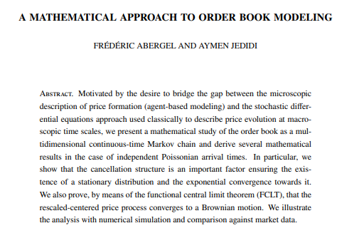

# Microtick price discovery simulation

This codebase is a simulator that allows market makers or researchers to fine-tune market conditions to experiment with a theoretical model of how price discovery might operate in the real world.

The mathematical approach used for the order book (left hand side of the real-time chart) is based on this 2013 paper: https://arxiv.org/abs/1010.5136.

Using the paper's approach for order rates as a model, the parameters for Microtick's Shelling point-based price discovery were created on the right hand side of the page.

## Running the simulation

### `npm start`

Runs the app in the development mode. 
Open [http://localhost:3000](http://localhost:3000) to view it in the browser.

At the initial start the order book needs to run for 120 seconds to generate enough information (i.e. volatility) for the Microtick parameters to start to operate.  As the simulation runs, the price history gets better leading to a more refined set of estimate for the Microtick quotes.

On the right, the quotes are divided into three shades of color.  The lightest correspond to 5-minute quotes, then 15-minute and 1-hour.  The yellow horizontal lines correspond to individual quote spots, with the consensus being the weighted average of all the quotes.

## Things to observe

The Microtick spot price is a weighted average, and as such will lag the order book price.  Alternatively, when the order book price mean-reverts, the Microtick price can be considered to be a leading price as well.

Being able to trade and hedge against a moving average price is unique in the financial markets.  It gives traders the ability and motive to sell into a price pump or buy into a selloff, as long as they are confident prices will mean revert in the time frame of the options they are trading on the Microtick market.  As such, the Microtick market tends to offset the order book price, bringing a price-stabilizing incentive into market arbitrage interplay.

## Things to try

1.  Start / Stop the simulation at any time using the buttons at the top.  The simulation runs 100% locally using random input so your simulation run will only affect your local instance.

2.  Increase the order book market order size.  Change the "Market | V" parameter from the default 4 to 5 or 6 and click "Set Orderbook Parameters".  This will increase the size of market orders on the order book simulation side, while keeping the limits the same.  The result will be an increase in volatility that over time will be reflected in the Microtick option volatility estimates.

3.  Observe the Market Maker / Trader profitabilies in the table.  Note that the default settings give a slight edge to the market makers - while individual trades can be profitable for the traders, over time the market maker tends to earn back the premium using the default parameters.

